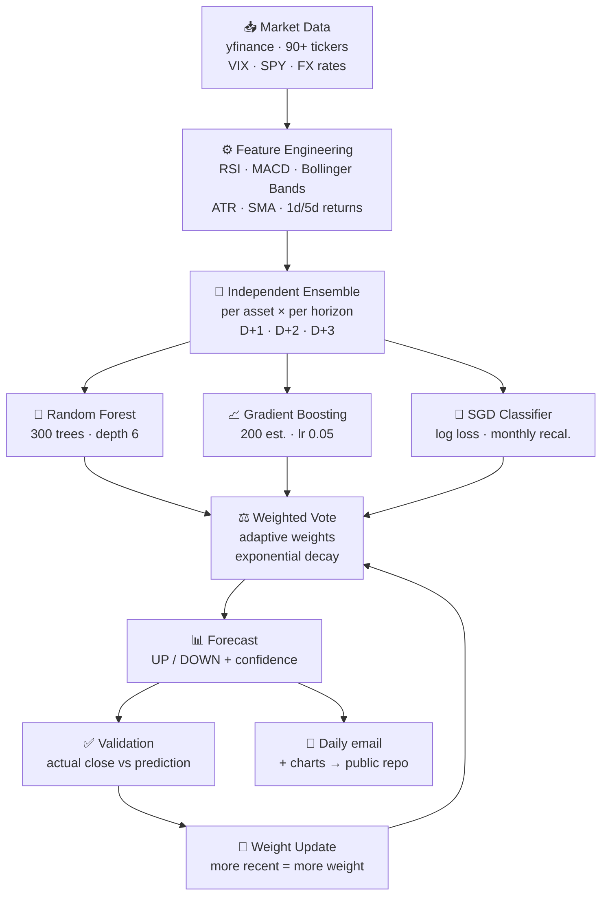

# smart-wallet-ml

> **Last updated:** 2026-05-29 &nbsp;·&nbsp; Charts from 2026-05-10 to 2026-05-19 (47 charts)

[](https://www.python.org/)
[](https://scikit-learn.org/)
[](https://github.com/srxkatsumi/smart-wallet-ml/actions)
[](https://github.com/srxkatsumi/smart-wallet-ml/commits/main)

---

## What is this?

An automated machine learning system that runs every weekday and generates daily directional forecasts for a personal investment portfolio using ensemble models.

The pipeline downloads fresh market data for 90+ assets, engineers technical indicators, trains three independent classifiers per asset per time horizon, validates each forecast against real closing prices, and reweights the models based on recent accuracy.

Charts are published here with a **10-day delay**. No prices, positions, or portfolio holdings are disclosed.

---

## How it works



---

## AI Models

Three classifiers are combined in a weighted ensemble. Each model was chosen for a specific reason:

| Model | Config | Why |
|-------|--------|-----|
| **Random Forest** | 300 trees, max depth 6 | Robust generaliser — bootstrapped trees resist overfitting on noisy market data. Acts as the ensemble's stability anchor. |
| **Gradient Boosting** | 200 estimators, lr 0.05 | Sequential residual learner — captures patterns RF misses, especially short-term momentum signals. Low learning rate prevents memorising noise. |
| **SGD Classifier** | log loss, L2 | Linear counterweight — cannot model non-linear interactions, so it acts as a dissenting vote when the other two agree on noise. Fully recalibrated monthly. |

### Why independent ensembles per horizon?

D+1, D+2, and D+3 are trained as **completely separate ensembles**. The patterns that predict tomorrow's price differ structurally from those that predict a 3-day move — conflating them into a single model produces weaker forecasts for all horizons.

### Adaptive weights with exponential decay

```
weight(model) ∝ accuracy(model) × Σ decay^(days_ago)
```

Recent correct predictions count more than older ones. If a model starts underperforming after a market regime change, the ensemble automatically reduces its vote share — no manual intervention needed.

---

## Features (what the model sees)

| Feature | Description |
|---------|-------------|
| `sma_20`, `sma_50` | Short and medium-term trend |
| `rsi_14` | Overbought / oversold signal |
| `macd`, `macd_signal` | Momentum and crossovers |
| `bb_upper`, `bb_lower`, `bb_width` | Volatility regime and price extremity |
| `atr_14` | Expected daily move magnitude |
| `ret_1d`, `ret_5d` | Recent momentum |
| `spy_ret_1d` | S&P 500 return (T-1) — global market context |
| `vix_level` | CBOE VIX close (T-1) — market fear level |
| `vix_change` | VIX daily change (T-1) — fear acceleration |
| `vix_regime` | VIX regime label: 0 = low (< 15), 1 = medium (15–25), 2 = high (≥ 25) |

All external context features use T-1 values to prevent data leakage.

---

## Tech stack

```
Python 3.11
├── yfinance       — market data (prices, FX, VIX, SPY)
├── scikit-learn   — RandomForest, GradientBoosting, SGDClassifier
├── pandas/numpy   — data processing and feature computation
├── joblib         — model serialisation
└── matplotlib     — chart generation

GitHub Actions     — free daily automation
```

---

## Accuracy context

| Benchmark | Target |
|-----------|--------|
| Random directional forecast | 50% |
| System target | 55–65% |
| Degradation signal | < 52% over 30+ validations |

---

## Verifiable accuracy

`predictions_log_public.csv` is published in this repository alongside the charts.
It contains every forecast made since the system went live, with the actual outcome filled in once the target date passes.

| Column | Content |
|--------|---------|
| `asset_type` | `portfolio` or `watchlist` — no ticker names disclosed |
| `pred_date` | Date the forecast was made |
| `target_date` | Date the forecast refers to |
| `direction` | `up` or `down` |
| `confidence` | Ensemble weighted probability |
| `correct` | `True` / `False` / `NaN` (NaN = stock split detected) |
| `model_rf` | Individual Random Forest vote |
| `model_gb` | Individual Gradient Boosting vote |
| `model_sgd` | Individual SGD Classifier vote |

No prices, tickers, or portfolio weights are included.

---

*Charts contain no financial advice, no portfolio positions, and no entry prices.
This is a personal data science project — not an investment product.*

Built by **Vicky Costa** — Data Analyst & Data Science student
[](https://www.linkedin.com/in/vickycosta/)
[](https://www.vickycosta.com)
