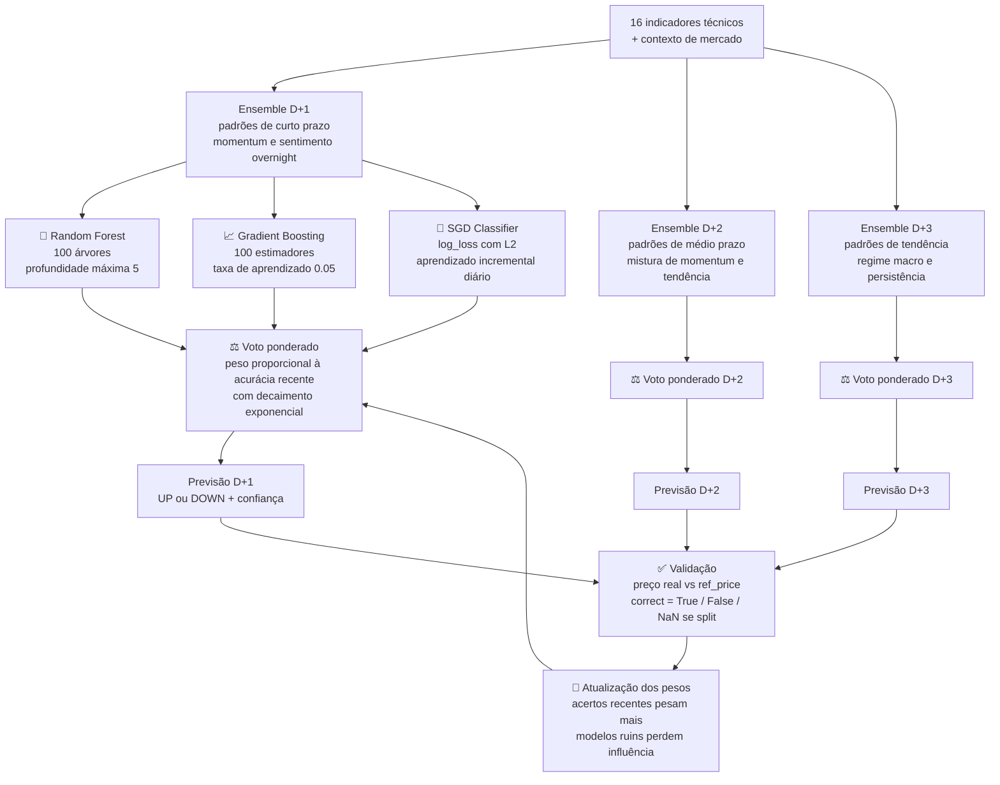

# Carteira Inteligente — Como eu construí um sistema de ML para prever minha carteira de investimentos

> Escrito por **Vicky Costa** — Analista de Dados e estudante de Ciência de Dados
> Este arquivo explica o projeto em linguagem acessível, para quem tem conhecimentos básicos de programação mas não tem background em Machine Learning ou finanças.

---

## 1. Por que construí este projeto

Durante um tempo administrei minha carteira de investimentos manualmente. Todo dia abria vários apps, via números vermelhos e verdes sem muito contexto, tentava lembrar o que tinha acontecido com aquele ativo semana passada e tomava decisões no feeling. Às vezes acertava. Às vezes errava. Mas nunca sabia exatamente por quê.

O problema não era falta de informação. Era excesso de informação sem organização, sem memória e sem critério objetivo.

Decidi construir um sistema que fizesse o que eu não conseguia fazer manualmente:

- Calcular meu ganho e perda real em euros, já com as taxas de corretagem incluídas
- Analisar os indicadores técnicos de cada ativo todo dia de forma consistente
- Fazer previsões direcionais para os próximos 3 dias úteis usando Machine Learning
- Guardar cada previsão, validar quando a data chegar, e usar os resultados para melhorar as próximas previsões
- Enviar tudo isso por email todo dia às 22h00 (Barcelona), quando todos os mercados já fecharam

O sistema não é um oráculo. Não prevê preços exatos. Não garante lucros. O que ele faz é gerar uma previsão direcional objetiva (vai subir ou vai cair?) com base nos dados disponíveis, e aprender com os próprios erros ao longo do tempo.

---

## 2. Como o sistema funciona no dia a dia

Todo dia útil, às 22h00 (horário de Barcelona), o GitHub Actions acorda automaticamente e executa a seguinte sequência:

```mermaid
flowchart TD
    A["⏰ GitHub Actions acorda\n22h00 Barcelona\n3 tentativas com anti-duplicação"] --> B["🔍 Já rodou hoje?\nLê predictions_log.csv\nSe já tem data de hoje, para aqui"]
    B -->|Ainda não rodou| C["📥 Baixa preços de ~90+ ativos\nEm grupos de 20 com pausa de 2s\nEvita bloqueio da API do Yahoo Finance"]
    C --> D["🔄 Verifica VIX e SPY\nSe algum retornou NaN\nUsa o valor do dia anterior\nMostra aviso âmbar no email"]
    D --> E["⚙️ Calcula os indicadores técnicos\nSMA, RSI, MACD, Bollinger Bands\nATR, retornos, volatilidade"]
    E --> F["✅ Valida previsões passadas\nCompara previsões antigas com preços reais\nDetecta possíveis stock splits acima de 40%"]
    F --> G["⚖️ Atualiza os pesos dos modelos\nModelos que acertaram recentemente\ntêm mais influência nas próximas previsões"]
    G --> H["🤖 Treina os 3 ensembles\nUm para D+1, um para D+2, um para D+3\nCada um aprende padrões do seu horizonte"]
    H --> I["💾 Salva as previsões de hoje\nD+1, D+2 e D+3 para cada ativo\nNo arquivo predictions_log.csv"]
    I --> J["📊 Gera 12 gráficos\nUm por ativo da carteira\nCom histórico de 120 dias + setas de previsão"]
    J --> K["📧 Monta o email HTML\nTabela de previsões, P&L, acurácia\nAlerta de drift, gráficos em anexo"]
    K --> L["🔁 Salva tudo no GitHub\nAté 3 tentativas se der erro\ngit pull + rebase antes de tentar de novo"]
    L --> M["📤 Envia por email via Gmail\nEmail HTML completo\nSe o push falhar, salva arquivo de emergência"]
    M --> N["🌐 Sincroniza o repositório público\nGráficos com 10 dias de atraso\nArquivo CSV anonimizado de acurácia"]
```



Cada vez que o sistema faz uma previsão, ele registra no arquivo `predictions_log.csv`. Quando a data alvo chega, ele busca o preço real, compara com o que previu, e marca como certo ou errado. Essa avaliação vai alimentar os pesos dos modelos no dia seguinte.

---

## 3. O que é Machine Learning neste contexto

Machine Learning é um conjunto de algoritmos que aprendem padrões a partir de dados históricos. Em vez de eu programar regras manualmente (ex: "se RSI > 70, vende"), os modelos encontram esses padrões sozinhos.

No meu sistema, o problema é de **classificação binária**: para cada ativo, o modelo precisa responder a uma pergunta simples.

"O preço de fechamento daqui a N dias úteis vai ser maior ou menor do que o preço de fechamento de hoje?"

Existem apenas duas respostas possíveis:

- `1` significa "vai subir" (UP)
- `0` significa "vai cair" (DOWN)

E essa pergunta é feita três vezes, para três horizontes de tempo diferentes:

- `target_d1` = `1` se `Close[t+1] > Close[t]`, caso contrário `0`
- `target_d2` = `1` se `Close[t+2] > Close[t]`, caso contrário `0`
- `target_d3` = `1` se `Close[t+3] > Close[t]`, caso contrário `0`

**Exemplo concreto com NVDA:**

Imaginemos que hoje é segunda-feira e a NVDA fechou em 850 dólares.

- O modelo D+1 vai tentar prever se na terça ela fecha acima ou abaixo de 850.
- O modelo D+2 vai tentar prever se na quarta ela fecha acima ou abaixo de 850.
- O modelo D+3 vai tentar prever se na quinta ela fecha acima ou abaixo de 850.

O ponto de referência é sempre o fechamento de hoje, não o preço que o modelo acha que ela deveria valer.

**Por que não tentar prever o preço exato?**

Prever um número exato (ex: "NVDA vai fechar em 863.27 dólares na terça") é muito mais difícil e muito menos útil do que prever a direção. Para a maioria das decisões de um investidor individual, saber "vai subir" ou "vai cair" já é informação suficiente para agir.

**Exemplo com BTC-USD:**

Bitcoin fechou hoje em 67.000. O modelo D+1 prevê `UP` com 68% de confiança. Isso não significa que o Bitcoin vai a 68.000. Significa que, com base nos indicadores técnicos disponíveis hoje, o modelo acha mais provável que o Bitcoin feche amanhã acima de 67.000 do que abaixo.

---

## 4. Os três modelos do ensemble e por que escolhi cada um

Em vez de usar um único modelo, usei três modelos diferentes que votam juntos. Essa estratégia se chama **ensemble** em Machine Learning.

A lógica por trás disso é simples: modelos diferentes cometem tipos diferentes de erros. Um modelo pode ser ótimo em tendências mas péssimo em reversões. Outro pode ser o oposto. Combinando os três, os erros de um tendem a ser compensados pelos acertos dos outros.



### Por que três ensembles independentes e não um único modelo?

Treinar um único modelo e reaproveitar sua saída para D+1, D+2 e D+3 é um erro comum. Os padrões que fazem um ativo subir amanhã são estruturalmente diferentes dos padrões que fazem ele subir daqui a três dias.

O movimento de amanhã é dominado por momentum de curtíssimo prazo e pelo sentimento do mercado no aftermarket de hoje. Um horizonte de 3 dias é mais influenciado pela persistência da tendência e pelo contexto macroeconômico. Misturar esses dois tipos de padrão num único modelo produz previsões piores para todos os horizontes.

Por isso treinei três ensembles completamente separados. Cada um aprende o que é relevante para o seu próprio horizonte, sem interferência dos outros.

---

### Modelo 1 — Random Forest

**Configuração:** 100 árvores de decisão, profundidade máxima 5.

**O que faz:**

O Random Forest cria 100 versões ligeiramente diferentes dos dados de treinamento (uma técnica chamada bootstrapping), treina uma árvore de decisão em cada versão, e combina as previsões de todas as árvores por votação majoritária.

Imagine que você perguntou a 100 analistas a mesma questão, cada um com acesso a um subconjunto diferente dos dados históricos. A resposta final é o que a maioria achou.

**Por que está no ensemble:**

É o modelo mais estável. A profundidade máxima de 5 evita que as árvores memorizem o barulho dos dados (overfitting). Funciona bem mesmo quando algumas features são irrelevantes — situação muito comum em séries temporais financeiras, onde a utilidade de cada indicador muda com o regime de mercado.

**O que seria diferente sem ele:**

Sem o Random Forest, o ensemble ficaria com apenas dois modelos, um dos quais (o SGD) é linear. A cobertura de padrões não-lineares complexos ficaria muito mais estreita, especialmente em regimes de alta volatilidade.

---

### Modelo 2 — Gradient Boosting

**Configuração:** 100 estimadores, profundidade máxima 3, taxa de aprendizado 0.05.

**O que faz:**

O Gradient Boosting constrói suas árvores em sequência, e cada nova árvore aprende especificamente com os erros da anterior. Em vez de 100 analistas independentes, pense em 100 analistas onde cada um recebe a lista de erros do anterior e tenta corrigir especificamente esses casos.

A taxa de aprendizado baixa (0.05) significa que cada nova árvore contribui apenas um pouquinho para a previsão final. Isso parece lento, mas é intencional: impede que o modelo aprenda de cor os casos específicos do passado em vez de capturar padrões reais.

**Por que está no ensemble:**

Captura padrões que o Random Forest não consegue capturar, especialmente sinais de momentum de curto prazo e interações sutis entre indicadores. É especialmente bom quando existe uma sequência temporal importante nos dados.

**O que seria diferente sem ele:**

O ensemble perderia capacidade de capturar padrões de momentum sequencial. Situações onde a tendência dos últimos dias é fortemente preditiva seriam subestimadas.

---

### Modelo 3 — SGD Classifier (Stochastic Gradient Descent)

**Configuração:** função de perda `log_loss`, regularização L2, alpha 0.0001, 1000 iterações máximas.

**O que faz:**

O SGD é um modelo linear. Ele aprende um conjunto de coeficientes (um peso por feature) e faz sua previsão calculando uma soma ponderada de todos os indicadores. Ao contrário do Random Forest e do Gradient Boosting, ele não consegue modelar interações complexas entre features.

Mas tem uma característica única: usa **partial_fit**, o que significa que todo dia aprende com os 5 dias mais recentes de dados sem esquecer o que aprendeu antes. É o único modelo do ensemble com aprendizado verdadeiramente incremental.

Todo mês passa por uma recalibração completa: o scaler é reajustado para a distribuição atual dos dados, e o modelo é retreinado do zero. Isso evita que os coeficientes lineares fiquem ancorados a uma realidade de mercado que já não existe.

**Por que está no ensemble:**

Funciona como um contrapeso. Quando o Random Forest e o Gradient Boosting concordam em algo que é na verdade ruído, o SGD, sendo linear e mais simples, frequentemente discorda. Essa discordância puxa o ensemble em direção a uma estimativa mais conservadora.

A simplicidade é uma vantagem deliberada, não uma limitação.

**O que seria diferente sem ele:**

Os dois modelos não-lineares podem entrar em ressonância, ambos detectando o mesmo padrão que existe apenas nos dados de treinamento mas não na realidade. O SGD serve como o "advogado do diabo" do ensemble.

---

## 4.5. O plano de expansão para 38 modelos em 13 famílias

Os três modelos descritos acima (RF, GB, SGD) são o ponto de partida, não o destino. O objetivo é testar sistematicamente todas as principais famílias de modelos de aprendizado de máquina aplicados a mercados financeiros ruidosos, onde qualquer edge marginal é academicamente interessante.

### As 13 famílias de modelos

**Família 1 — Clássico** (já parcialmente implementado)
RF, GB, SGD, XGBoost, LightGBM, CatBoost, SVM. São os modelos mais citados em papers de ML aplicado e constituem a base de comparação obrigatória para qualquer estudo académico.

**Família 2 — Séries temporais**
ARIMA, SARIMA, ETS, Holt-Winters, Prophet. Estes modelos foram construídos especificamente para dados com dependência temporal. O Prophet (Meta) é especialmente poderoso para dados com sazonalidade marcada.

**Família 3 — Estado oculto**
Cadeias de Markov e HMM (Hidden Markov Model). Modelam a ideia de que o mercado pode estar em diferentes "estados" (bull, bear, lateral) que não são diretamente observáveis mas influenciam o comportamento dos preços. São os modelos mais naturais para detetar regimes de mercado.

**Família 4 — Redes neurais recorrentes**
LSTM e GRU. Redes neurais com memória temporal. Aprendem dependências de longo prazo entre observações sequenciais — algo que o RF e o GB não conseguem fazer por design.

**Família 5 — Redes neurais com atenção**
Transformer, TFT (Temporal Fusion Transformer) e N-BEATS. O Transformer aprende a "prestar atenção" a momentos específicos do passado que são relevantes para a previsão atual. O TFT é o estado da arte em previsão multi-horizonte (publicado pelo Google em 2021).

**Família 6 — Modelos bayesianos**
Gaussian Process e BNN (Bayesian Neural Network). A vantagem principal é a quantificação de incerteza: em vez de prever apenas a direção, estes modelos dizem também "quão confiantes estão" com base na teoria da probabilidade. Fundamental para um júri académico que questione a robustez das previsões.

**Família 7 — Modelos generativos**
VAE (Variational Autoencoder) e GAN (Generative Adversarial Network). Em vez de prever a próxima observação, aprendem a distribuição dos dados e geram amostras sintéticas que respeitam os padrões aprendidos. A pergunta central é: o modelo aprende alguma estrutura real, ou apenas reproduce ruído?

---

### As 13 famílias e o que cada uma acrescenta

| Família | Modelos | O que diferencia |
|---------|---------|-----------------|
| Clássico (RF, GB, SGD, XGBoost, LightGBM, CatBoost, SVM) | Aprende padrões tabulares pontuais. Baseline obrigatório em qualquer estudo. |
| Estado oculto (Markov, HMM) | Modela regimes ocultos do mercado financeiro — bull, bear, lateral — que não são directamente observáveis mas influenciam o comportamento dos preços. |
| Séries temporais (ARIMA, SARIMA, ETS, Holt-Winters, Prophet) | Testa autocorrelação temporal directamente. Modelos desenhados para dados com memória. |
| Neural recorrente (LSTM, GRU) | Memória de longo alcance. Aprende dependências entre observações distantes na sequência. |
| Neural com atenção (Transformer, TFT, N-BEATS) | Atenção selectiva. O modelo aprende a "olhar" para os momentos do passado mais relevantes para cada previsão. |
| Bayesiano (GP, BNN) | Incerteza calibrada. Além da previsão, quantifica o quão confiante está — academicamente exige justificação quando a confiança é alta. |
| Generativo (VAE, GAN) | Aprende a distribuição dos dados. Testa se existe estrutura latente separável entre UP e DOWN. |
| Reinforcement (DQN, PPO) | Optimiza política, não previsão. Trata a decisão de compra/venda como uma sequência de acções com recompensa — completamente diferente de todas as outras famílias. |
| Contrarian / Testes de sanidade (CB, EWI, PEL) | Inverte ou corrige o ensemble. Testa se o modelo principal é pior que o acaso, detecta regimes de erro sistemático e aprende com a autocorrelação dos erros. |
| Arquitecturas eficientes — pós-2022 (TCN, DLinear, NLinear, PatchTST) | Alternativas ao Transformer que em vários benchmarks o superam com muito menos complexidade. A questão central: vale a pena toda a complexidade do Transformer? |
| Foundation Models — 2023-2024 (Chronos, TimesFM, Moirai) | Modelos pré-treinados em biliões de pontos de dados. Funcionam sem treino — zero-shot. A questão central: valem mais que 38 modelos treinados do zero nos meus dados? |
| Incerteza calibrada (Conformal Prediction) | Garante matematicamente que "90% de confiança" significa que o intervalo de previsão contém o valor real em pelo menos 90% dos casos. Rigor estatístico que nenhuma das outras famílias oferece. |
| Detecção de drift (ADWIN, Page-Hinkley) | Detecta automaticamente quando o mercado mudou de regime e os modelos perdem validade. Complementa o alerta manual de ρ de Spearman com deteção estatística formal. |

---

### Reinforcement Learning — o ângulo diferente

Todas as outras famílias resolvem o mesmo problema: "dado X hoje, qual é a probabilidade de UP amanhã?" O RL resolve um problema diferente: "dada a sequência de observações até agora, qual é a melhor política de decisão para maximizar a recompensa acumulada?"

**DQN (Mnih et al., 2015 — Nature):** aprende Q(estado, acção) — o valor esperado de tomar a acção UP ou DOWN em cada estado. A política emerge implicitamente: escolhe a acção com maior Q-value.

**PPO (Schulman et al., 2017 — arXiv):** aprende a política π(acção|estado) directamente com um Actor-Critic. O Actor decide o que fazer; o Crítico avalia se foi boa decisão. O clipping ε=0.2 impede que a política mude demasiado de uma vez, tornando o treino estável.

A diferença conceptual fundamental: modelos supervisionados minimizam uma loss pontual. Modelos de RL optimizam recompensa acumulada sobre uma sequência de decisões. Para trading, esta distinção é real — uma decisão errada hoje pode ter consequências que se estendem pelos dias seguintes.

---

---

## 4.6. A nova geração de modelos (Famílias 9 a 12)

As famílias 1 a 8 cobrem bem o estado da arte até 2021. Entre 2022 e 2024 surgiu uma nova vaga de modelos que mudou o que consideramos possível em previsão de séries temporais. Esta secção explica cada família nova com exemplos práticos da carteira.

---

### Família 9 — Arquitecturas eficientes (TCN, DLinear, NLinear, PatchTST)

Em 2023, um grupo de investigadores da UCSF publicou um artigo que causou surpresa: um modelo linear simples, chamado DLinear, batia os Transformers mais sofisticados em múltiplos benchmarks de previsão de séries temporais. O artigo chamava-se "Are Transformers Effective for Time Series Forecasting?" (Zeng et al., 2023).

A questão central desta família: toda a complexidade do Transformer (atenção multi-cabeça, embeddings posicionais, tokenização) traz benefício real quando aplicada à carteira, ou um modelo mais simples é suficiente?

**TCN (Temporal Convolutional Network)**

O TCN usa convoluções dilatadas em vez de recorrência ou atenção. Imagine uma rede de filtros que olha para o passado como se estivesse a analisar uma imagem: cada filtro cobre uma janela de tempo e a dilatação permite que filtros maiores cubram horizontes mais longos sem aumentar o número de parâmetros.

Exemplo prático com NVDA: o TCN aprende um filtro que olha para a sequência RSI14 dos últimos 20 dias e detecta padrões de contracção antes de um movimento brusco. Enquanto o LSTM "lembra" esses 20 dias através do estado interno da célula, o TCN processa tudo em paralelo, como se fosse uma convolução 1D sobre a série temporal.

**DLinear e NLinear**

São os modelos mais simples desta família. O DLinear faz uma decomposição da série em tendência e resíduo, e aprende uma regressão linear separada para cada componente. O NLinear normaliza os dados pelo último valor antes de aplicar a regressão.

Exemplo prático com ALV.DE: se o preço de fecho nos últimos 20 dias for 295, 297, 302, 305, 303, o DLinear separa a tendência linear (subida de ~2,5 euros por dia) do resíduo (os desvios em torno dessa tendência) e prevê os dois componentes separadamente antes de os somar. O NLinear simplesmente subtrai 303 de todos os valores, aprende a prever o desvio relativo, e depois soma 303 ao resultado.

O resultado surpreendente do paper de Zeng et al. é que estes dois modelos triviais batem o Transformer em 7 dos 9 datasets públicos testados. Se o DLinear bater o Transformer nos dados da carteira, isso é um argumento forte: simplicidade vence complexidade quando os dados têm estrutura linear dominante.

**PatchTST (Nie et al., 2023 — Princeton / IBM)**

O PatchTST resolve um problema fundamental do Transformer original: quando aplicado a séries temporais, cada ponto de tempo é tratado como um token separado. Para uma série de 500 dias, isso gera 500 tokens e a atenção tem custo quadrático (500 × 500 = 250.000 pares).

O PatchTST divide a série em "patches" (segmentos sobrepostos de, por exemplo, 16 dias) e trata cada patch como um token. Para 500 dias com patches de 16, há apenas ~31 tokens em vez de 500. A atenção fica muito mais eficiente e cada token contém contexto local em vez de um único ponto isolado.

Exemplo prático com BTC-USD: em vez de o Transformer "olhar" para cada dia de preço separadamente, o PatchTST olha para blocos de 16 dias. Cada bloco captura um mini-ciclo de mercado. A atenção entre blocos captura como mini-ciclos passados se relacionam com o mini-ciclo actual.

---

### Família 10 — Foundation Models (Chronos, TimesFM, Moirai)

Esta família representa uma mudança de paradigma. Todos os modelos das famílias 1 a 9 são treinados nos meus dados da carteira, do zero, a cada execução. Os Foundation Models chegam já treinados em centenas de milhões de séries temporais reais de domínios completamente diferentes.

A ideia é a mesma que levou ao sucesso do ChatGPT: pré-treinar num corpus massivo e generalizar para novas tarefas sem treino adicional. Em inglês, isso chama-se **zero-shot forecasting** porque o modelo faz previsões em dados que nunca viu, sem nenhum treino específico.

**Chronos (Amazon, 2024)**

O Chronos (Ansari et al., 2024) converte séries temporais em tokens discretos usando quantização, e depois aplica um Transformer de linguagem (baseado na arquitectura T5 do Google) para prever os próximos tokens. Foi pré-treinado em ~700.000 séries temporais de domínios variados: energia, tráfego, vendas, meteorologia, finanças.

Exemplo prático com LLY: em vez de treinar o Chronos nos preços históricos da Eli Lilly, simplesmente paso os últimos 50 preços de fecho e peço ao modelo para prever os próximos 3. O modelo usa o conhecimento acumulado de 700.000 séries para fazer a previsão, sem saber que se trata de uma acção farmacêutica ou sequer que se trata de dados financeiros.

A questão central: o Chronos, sem nunca ter visto dados da LLY, consegue bater o ensemble RF/GB/SGD que foi treinado especificamente nos dados da LLY durante meses? Se sim, é um argumento poderoso de que os padrões de séries temporais são transferíveis entre domínios.

**TimesFM (Google, 2024)**

O TimesFM (Das et al., 2024) foi pré-treinado em 100 biliões de pontos de dados reais, o maior corpus de pré-treino em séries temporais até à data. Usa uma arquitectura de Transformer com patches e consegue fazer previsões multi-horizonte (D+1, D+2, D+3) num único passo.

Exemplo prático com EMIM.AS: o ETF de mercados emergentes tem padrões sazonais ligados ao ciclo fiscal de vários países e às decisões do Federal Reserve. O TimesFM, treinado em séries de commodities, taxas de câmbio e índices globais, pode ter aprendido implicitamente estes padrões sem precisar de treino explícito nos dados do EMIM.AS.

**Moirai (Salesforce, 2024)**

O Moirai (Woo et al., 2024) é treinado em dados de múltiplas frequências temporais em simultâneo (por hora, por dia, por semana, por mês) e aprende representações universais de padrões temporais. A sua vantagem é que não precisa saber a frequência dos dados de entrada: infere-a automaticamente.

A comparação entre os três Foundation Models é por si só interessante: foram treinados em corpora diferentes, com arquitecturas ligeiramente diferentes, e espera-se que tenham pontos fortes distintos.

**O que torna esta família relevante**

A questão central é: o que é que os 38 modelos treinados do zero oferecem que um Foundation Model pré-treinado não oferece? A resposta pode ir em duas direcções opostas:

1. O Foundation Model ganha: os padrões de séries temporais são universais e o pré-treino em dados massivos supera treino específico com dados limitados. Conclusão: para carteiras pequenas com poucos anos de dados, Foundation Models são superiores.

2. Os modelos treinados ganham: os padrões financeiros são suficientemente específicos (microestrutura de mercado, correlações entre ativos, regime de volatilidade) para que o treino nos dados locais seja vantajoso. Conclusão: o contexto de domínio importa e não é capturado pelo pré-treino genérico.

Ambas as conclusões têm valor prático.

---

### Família 11 — Incerteza calibrada (Conformal Prediction)

Todos os modelos das famílias 1 a 10 produzem uma probabilidade. O ensemble diz "68% de confiança em UP". Mas o que significa esse 68%?

Para a maioria dos modelos, não significa nada estatisticamente rigoroso. É uma calibração interna do modelo que pode estar muito longe da realidade. Um ensemble que diz "90% de confiança" pode ter acurácia real de apenas 55% nos casos com essa confiança.

A Conformal Prediction (Vovk, Gammerman e Shafer, 2005) é a única família que oferece uma **garantia matemática**: se o modelo diz "intervalo de previsão a 90%", então em pelo menos 90% dos casos o valor real cai dentro desse intervalo, independentemente da distribuição dos dados e sem suposições sobre o modelo subjacente.

**Como funciona na prática**

Em vez de produzir uma probabilidade pontual, a Conformal Prediction produz um conjunto de previsão: todas as respostas que seriam plausíveis dado o historial de erros do modelo.

Passo 1: separar uma "calibração set" de dados históricos que o modelo nunca viu durante o treino.

Passo 2: calcular os "non-conformity scores" de cada previsão na calibração set. Para previsão de direcção, o score é simplesmente a probabilidade atribuída à classe errada. Se o modelo previu UP com 70% e a ação de facto subiu, o score é 30%. Se previu UP com 70% mas a ação caiu, o score é 70%.

Passo 3: para um nível de confiança de 90%, calcular o quantil 90% dos scores históricos. Chame-se esse valor q*.

Passo 4: numa nova previsão, aceitar como "plausível" qualquer direcção cuja probabilidade de estar errada seja menor que q*. Se q* = 0,40, apenas previsões com probabilidade acima de 60% são incluídas no conjunto de previsão.

**Exemplo concreto com SGLN.L (ouro físico)**

Imagine que nos últimos 100 dias o ensemble previu UP com probabilidade média de 65% para o ouro, mas a acurácia real foi de apenas 52%. Os non-conformity scores mostram que, apesar da aparente confiança, o modelo erra muito.

Com Conformal Prediction a 90%, o conjunto de previsão seria muito mais honesto: em vez de dizer "UP com 65%", diria "o conjunto de previsão a 90% inclui tanto UP como DOWN" — sinalizando que não há evidência suficiente para excluir nenhuma das direcções com esse nível de confiança.

Quando o conjunto de previsão é unitário (só UP ou só DOWN), isso é um sinal genuinamente forte: o modelo está suficientemente confiante para excluir a alternativa com garantia formal.

**Por que é importante**

Para um júri académico, "68% de confiança" sem calibração estatística é uma afirmação fraca. "O conjunto de previsão a 90% é unitário" é uma afirmação com garantia matemática verificável. A Conformal Prediction transforma as previsões do sistema de assertivas informais em proposições estatisticamente auditáveis.

---

### Família 12 — Detecção de drift (ADWIN, Page-Hinkley)

O sistema já tem um alerta manual de drift: o ρ de Spearman que compara o ranking de features de hoje com o período de referência. Se ρ < 0,70, aparece um aviso no email.

Mas isso é reativo: eu vejo o aviso depois de o drift já ter acontecido. A Família 12 introduz deteção estatística formal de mudança de ponto, conhecida em inglês como **change point detection** ou **concept drift detection**.

**ADWIN (Adaptive Windowing, Bifet e Gavaldà, 2007)**

O ADWIN mantém uma janela deslizante de observações recentes e testa continuamente se a média da primeira metade da janela é estatisticamente diferente da média da segunda metade.

Se a diferença for significativa (acima de um threshold configurável), o ADWIN detecta drift e descarta a parte mais antiga da janela, adaptando-se ao novo regime.

Exemplo prático com o VIX: durante um mercado calmo (VIX entre 12 e 18), o modelo aprende que RSI14 e MACD são as features mais preditivas. Quando o VIX sobe abruptamente para 35 (regime de crise), a relação entre as features e os retornos muda completamente. O ADWIN detecta esta mudança estatisticamente e sinaliza que os modelos foram treinados num regime diferente do actual.

**Page-Hinkley (Page, 1954)**

O teste de Page-Hinkley foi criado originalmente para controlo de qualidade industrial (detectar quando uma linha de produção sai do limite de tolerância) e aplica-se directamente à acurácia do modelo: monitoriza a soma cumulativa dos desvios entre a acurácia observada e a acurácia esperada.

Fórmula:
```
M_t = M_{t-1} + (acurácia_t - acurácia_esperada - delta)
T_t = M_t - min(M_0, M_1, ..., M_t)

Drift detectado quando T_t > lambda
```

Onde `delta` é a tolerância (tipicamente 0,01) e `lambda` é o threshold de alarme.

Exemplo prático com a NVDA: se o ensemble tinha 58% de acurácia durante 3 meses e de repente começa a errar sistematicamente (52%, 49%, 48%, 51%, 47%), o Page-Hinkley detecta a degradação cumulativa muito antes de a acurácia média dos últimos 30 dias mostrar uma descida clara.

**A diferença entre as duas abordagens**

O ADWIN detecta mudanças nos dados de entrada (as features mudam de distribuição). O Page-Hinkley detecta mudanças na performance do modelo (o modelo começa a errar mais). São complementares: o ADWIN alerta antecipadamente quando o mercado muda de regime; o Page-Hinkley alerta quando essa mudança já está a afectar as previsões.

A combinação das duas garante que o sistema monitoriza activamente a sua própria validade — uma propriedade que a maioria dos sistemas de ML em produção não tem.

---

O modelo não vê os preços brutos. Ele recebe 16 indicadores derivados do histórico de preços e do contexto de mercado. Esses indicadores são chamados de **features** em Machine Learning.

A tabela abaixo lista todas as 16 features, na ordem exata em que aparecem no código:

---

### 1. SMA20_dist — Distância percentual da Média Móvel de 20 dias

**O que mede:** o quanto o preço atual está acima ou abaixo de sua média dos últimos 20 dias úteis, em percentual.

**Fórmula:** `SMA20_dist = (Close - SMA20) / SMA20`

**Exemplo:** se NVDA fechou em 850 e sua SMA20 é 820, então `SMA20_dist = (850 - 820) / 820 = +3.66%`. O ativo está 3.66% acima da sua média de curto prazo.

**SMA (Simple Moving Average):** é a média aritmética dos preços de fechamento dos últimos N dias. Sua fórmula é `SMA_N = (Close_1 + Close_2 + ... + Close_N) / N`. A SMA é de uso histórico sem autor único definido, amplamente adotada desde o século XX em análise técnica.

**Por que incluí:** valores muito positivos indicam que o ativo está sobrecomprado em relação à sua tendência recente. Valores muito negativos indicam o oposto. O modelo aprende se existe tendência de reversão nesses extremos.

---

### 2. SMA50_dist — Distância percentual da Média Móvel de 50 dias

**O que mede:** o quanto o preço atual está acima ou abaixo de sua média dos últimos 50 dias úteis, em percentual.

**Fórmula:** `SMA50_dist = (Close - SMA50) / SMA50`

**Exemplo:** se ALV.DE fechou em 310 euros e sua SMA50 é 295, então `SMA50_dist = +5.08%`. O ativo está 5% acima da tendência de médio prazo.

**Por que incluí:** enquanto a SMA20 captura o momentum de curto prazo, a SMA50 captura o alinhamento com a tendência de médio prazo. Quando as duas apontam na mesma direção, o sinal é mais forte.

---

### 3. sma_cross — Cruzamento das médias móveis

**O que mede:** se a SMA20 está acima ou abaixo da SMA50.

**Fórmula:** `sma_cross = 1` se `SMA20 > SMA50`, caso contrário `0`

**Exemplo:** quando a SMA20 cruza para cima da SMA50, `sma_cross` vira 1. Esse cruzamento é conhecido no mercado como "Golden Cross" e historicamente precede tendências de alta. O cruzamento oposto é o "Death Cross".

**Por que incluí:** cruzamentos de médias são um dos sinais mais estudados na análise técnica. Em vez de detectar o cruzamento pela geometria do gráfico, o modelo aprende diretamente a partir do valor binário desta feature se ele é preditivo para cada ativo e horizonte.

---

### 4. RSI14 — Relative Strength Index de 14 dias

**O que mede:** a força relativa do movimento de alta em relação ao movimento de baixa nos últimos 14 dias. Varia de 0 a 100.

**Fórmula completa:**
```
delta = diferença diária dos preços de fechamento
gain  = média das variações positivas dos últimos 14 dias
loss  = média das variações negativas dos últimos 14 dias (em valor absoluto)
RS    = gain / loss
RSI14 = 100 - (100 / (1 + RS))
```

**Exemplo:** se BABA subiu em 9 dos últimos 14 dias com ganho médio de 1.5% e caiu em 5 dias com perda média de 0.8%:
- RS = 1.5 / 0.8 = 1.875
- RSI = 100 - (100 / 2.875) = 65.2

Um RSI de 65 indica pressão compradora moderada. Acima de 70, considera-se sobrecomprado. Abaixo de 30, sobrevendido.

**Criado por:** J. Welles Wilder Jr., engenheiro mecânico e analista técnico americano, publicado no livro "New Concepts in Technical Trading Systems" em 1978.

**Por que incluí:** o RSI é um dos indicadores mais confiáveis para detectar condições de extremo. Ativos com RSI muito alto ou muito baixo tendem a reverter com mais frequência do que continuar na mesma direção. O modelo aprende qual nível de RSI é relevante para cada ativo.

---

### 5. MACD — Moving Average Convergence Divergence

**O que mede:** a diferença entre duas médias exponenciais (EMA) de períodos diferentes. Captura momentum e mudanças de tendência.

**Fórmula:**
```
EMA12 = média exponencial dos últimos 12 dias
EMA26 = média exponencial dos últimos 26 dias
MACD  = EMA12 - EMA26
```

A diferença entre EMA e SMA é que a EMA dá mais peso aos dados mais recentes. Uma EMA de 12 dias "esquece" o passado mais rapidamente do que uma SMA de 12 dias.

**Exemplo:** se EMA12 de LLY é 825 e EMA26 é 810, então MACD = +15. Um MACD positivo e crescente indica que o momentum de curto prazo está acelerando para cima.

**Criado por:** Gerald Appel, analista técnico e gestor de fundos americano, desenvolvido no final dos anos 1970 e publicado em 1979.

**Por que incluí:** o MACD captura tanto a direção do momentum quanto sua velocidade de mudança. Quando o MACD cruza a linha zero de baixo para cima, é frequentemente sinal de mudança de tendência de baixa para alta.

---

### 6. MACD_sig — Linha de sinal do MACD

**O que mede:** uma média exponencial de 9 dias do próprio MACD. Serve como "suavizador" do MACD.

**Fórmula:** `MACD_sig = EMA9 do MACD`

**Por que incluí:** o cruzamento entre MACD e MACD_sig é um dos sinais de entrada e saída mais usados na análise técnica. Quando o MACD cruza para cima do MACD_sig, é sinal de alta. O modelo aprende se esses cruzamentos têm poder preditivo para cada ativo específico.

---

### 7. MACD_hist — Histograma do MACD

**O que mede:** a diferença entre o MACD e sua linha de sinal. Quantifica a distância entre os dois.

**Fórmula:** `MACD_hist = MACD - MACD_sig`

**Exemplo:** se MACD é +15 e MACD_sig é +10, então MACD_hist = +5. Um histograma crescente indica que o momentum está se acelerando. Um histograma diminuindo indica desaceleração mesmo que a direção continue a mesma.

**Por que incluí:** o histograma captura a aceleração do momentum, não apenas sua direção. Ativos com histograma decrescente frequentemente revertem antes mesmo que o MACD cruze a linha de sinal.

---

### 8. BB_width — Largura das Bandas de Bollinger

**O que mede:** a largura relativa das Bandas de Bollinger em relação à SMA20. Captura o regime de volatilidade.

**Fórmula:**
```
SMA20     = média dos últimos 20 dias
STD20     = desvio padrão dos últimos 20 dias
BB_upper  = SMA20 + 2 × STD20
BB_lower  = SMA20 - 2 × STD20
BB_width  = (BB_upper - BB_lower) / SMA20
```

**Exemplo:** se SMA20 de EMIM.AS é 30 euros e o desvio padrão é 0.6, então:
- BB_upper = 31.2, BB_lower = 28.8
- BB_width = 2.4 / 30 = 0.08 (8%)

Uma BB_width de 8% indica volatilidade moderada. Em momentos de crise, esse valor pode triplicar.

**Criadas por:** John Bollinger, analista técnico americano, desenvolvidas nos anos 1980 e popularizadas no livro "Bollinger on Bollinger Bands" (2001).

**Por que incluí:** o regime de volatilidade é fundamental para qualquer previsão. Um ativo em modo de baixa volatilidade (bandas estreitas) se comporta de forma completamente diferente de um ativo em modo de alta volatilidade (bandas largas). O modelo aprende a condicionar suas previsões ao regime atual.

---

### 9. BB_pos — Posição dentro das Bandas de Bollinger

**O que mede:** onde o preço atual está dentro das bandas, de 0 (na banda inferior) a 1 (na banda superior).

**Fórmula:** `BB_pos = (Close - BB_lower) / (BB_upper - BB_lower)`

**Exemplo:** se BTC-USD fechou em 67.000, BB_lower é 62.000 e BB_upper é 72.000, então:
- BB_pos = (67.000 - 62.000) / (72.000 - 62.000) = 0.5

Valor 0.5 indica que o Bitcoin está exatamente no meio das bandas. Um valor de 0.95 indica que está próximo da banda superior (possível sobrecompra). Um valor de 0.05 indica que está próximo da banda inferior (possível sobrevenda).

**Por que incluí:** complementa o BB_width ao informar não apenas o quão largas são as bandas, mas onde exatamente o preço está dentro delas. Preços nos extremos das bandas têm histórico de reversão estatisticamente acima da média.

---

### 10. ATR14 — Average True Range de 14 dias

**O que mede:** o intervalo real médio de variação diária de um ativo nos últimos 14 dias. Mede a volatilidade absoluta em unidades de preço.

**Fórmula:**
```
True Range de cada dia = máximo entre:
  1. High - Low (variação do dia)
  2. |High - Close_anterior| (gap de alta)
  3. |Low  - Close_anterior| (gap de baixa)

ATR14 = média dos True Ranges dos últimos 14 dias
```

**Exemplo:** se NVDA tem ATR14 de 20 dólares, isso significa que, em média nos últimos 14 dias, o preço oscilou 20 dólares por dia (entre a mínima e a máxima, contando gaps). Um dia onde NVDA varia menos de 10 dólares é um dia de baixa volatilidade para ela.

**Criado por:** J. Welles Wilder Jr., publicado no mesmo livro de 1978 que o RSI.

**Por que incluí:** o ATR contextualiza o tamanho dos movimentos. Uma variação de 2% para um ativo que normalmente se move 0.5% ao dia é um evento extremo. Para um ativo que normalmente se move 3% ao dia, é trivial. O modelo precisa dessa informação para calibrar suas previsões.

O ATR14 também é usado para calcular o `pred_price` (preço estimado na previsão): `close ± ATR14 × 0.5 × √horizon`. Mas esse valor é apenas informativo — a previsão real do modelo é apenas a direção (UP ou DOWN).

---

### 11. ret_1d — Retorno de 1 dia

**O que mede:** a variação percentual do preço de fechamento em relação ao dia anterior.

**Fórmula:** `ret_1d = (Close_hoje - Close_ontem) / Close_ontem`

**Exemplo:** se ALV.DE fechou ontem em 300 euros e hoje em 306 euros, então `ret_1d = +2%`.

**Por que incluí:** o retorno do dia anterior é um dos preditores de momentum mais diretos. Ativos que subiram muito ontem têm maior probabilidade de continuação de curto prazo (momentum) em algumas condições de mercado, e maior probabilidade de reversão em outras. O modelo aprende qual padrão é válido para cada ativo.

---

### 12. ret_5d — Retorno de 5 dias

**O que mede:** a variação percentual do preço de fechamento em relação a 5 dias atrás (aproximadamente uma semana de trading).

**Fórmula:** `ret_5d = (Close_hoje - Close_5_dias_atrás) / Close_5_dias_atrás`

**Por que incluí:** enquanto `ret_1d` captura o momentum imediato, `ret_5d` captura a tendência da semana. Um ativo que subiu 10% em 5 dias está em um contexto muito diferente de um que ficou estável. O modelo usa essa diferença para contextualizar sua previsão.

---

### 13. vol_10d — Volatilidade realizada de 10 dias

**O que mede:** o desvio padrão dos retornos diários dos últimos 10 dias. Mede o quão errática tem sido a variação do ativo recentemente.

**Fórmula:** `vol_10d = desvio_padrão(ret_1d dos últimos 10 dias)`

**Exemplo:** se nos últimos 10 dias a NVDA variou +2%, -3%, +1%, -4%, +2%, -1%, +3%, -2%, +4%, -2%, a `vol_10d` seria alta (muita dispersão). Se variou +0.3%, +0.1%, -0.2%, +0.3%, -0.1%, +0.2%, -0.1%, +0.1%, -0.2%, +0.3%, seria muito baixa.

**Por que incluí:** a volatilidade recente é preditiva da volatilidade futura. Ativos em fases de alta agitação tendem a continuar agitados. O modelo aprende que previsões em momentos de alta `vol_10d` devem ser tratadas com menos confiança.

---

### 14. spy_ret_1d — Retorno do S&P 500 do dia anterior

**O que mede:** a variação percentual do ETF SPY (que replica o índice S&P 500) no dia anterior (T-1).

**Fórmula:** `spy_ret_1d = retorno_percentual(SPY_fechamento_ontem)`

**Por que T-1 e não o retorno de hoje:** porque o modelo usa os dados disponíveis no momento da previsão, que é às 22h00. Nesse horário, os mercados já fecharam, então o dado do dia corrente (T-0) está disponível. Mas para manter consistência com como o modelo foi treinado (onde T-1 era o dado disponível antes da sessão), uso sempre T-1.

**Exemplo:** se ontem o S&P 500 caiu 2%, todas as ações americanas da minha carteira (NVDA, LLY, BABA) foram influenciadas por esse contexto. O modelo pode aprender que em dias seguintes a grandes quedas do S&P, determinados ativos tendem a recuperar ou continuar caindo.

**Por que incluí:** o S&P 500 é o barômetro do humor do mercado americano. NVDA num dia após uma queda de 2% do S&P comporta-se de forma muito diferente de NVDA num dia após uma alta de 2%. Sem essa feature, o modelo tomaria decisões sem contexto global.

---

### 15. vix_level — Nível do VIX do dia anterior

**O que mede:** o nível de fechamento do CBOE Volatility Index (VIX) do dia anterior. O VIX mede a volatilidade implícita das opções do S&P 500 para os próximos 30 dias. É também chamado de "índice do medo".

**Valores de referência:**
- VIX abaixo de 15: mercado calmo, baixa ansiedade
- VIX entre 15 e 25: volatilidade moderada, cautela crescente
- VIX acima de 30: medo elevado, crise em andamento
- VIX acima de 40: pânico (aconteceu em março de 2020 durante a COVID, chegou a 82)

**Por que incluí:** um VIX de 14 e um VIX de 35 representam regimes de mercado completamente diferentes. O comportamento de um ativo durante crise (VIX alto) é estruturalmente diferente de seu comportamento durante calma (VIX baixo). Sem essa feature, o modelo não sabe em que tipo de ambiente está operando.

---

### 16. vix_change — Variação diária do VIX do dia anterior

**O que mede:** a variação percentual do VIX de um dia para o outro (T-2 para T-1).

**Fórmula:** `vix_change = (VIX_ontem - VIX_anteontem) / VIX_anteontem`

**Exemplo:** se o VIX estava em 18 anteontem e ontem subiu para 22, então `vix_change = +22%`. Isso indica que o medo do mercado acelerou muito rapidamente.

**Por que incluí:** o nível absoluto do VIX (`vix_level`) e a aceleração do VIX (`vix_change`) são informações complementares. Um VIX de 22 que vem de 20 (variação de +10%) é muito diferente de um VIX de 22 que vem de 35 (variação de -37%). O primeiro indica medo crescente. O segundo indica alívio. O modelo precisa distinguir esses dois cenários.

---

## 6. Como os pesos adaptativos funcionam

Cada modelo do ensemble recebe um peso. Esse peso determina quanto a voz daquele modelo vale na decisão final.

No início, todos os modelos têm peso igual: RF = 1.0, GB = 1.0, SGD = 1.0. Após as primeiras validações, os pesos começam a se diferenciar com base em quem acertou mais recentemente.

**A fórmula matemática:**

```
peso(modelo) ∝ acurácia(modelo) × Σ decay^(dias_atrás)
```

Onde:
- `acurácia(modelo)` é a proporção de acertos nas últimas 30 validações
- `decay` é o fator de decaimento exponencial (= 0.1 no sistema)
- `dias_atrás` é quantos dias atrás aconteceu cada previsão
- O símbolo ∝ significa "proporcional a" (os pesos são normalizados para somar 3.0 no total)

**O que o decaimento exponencial significa:**

Em vez de tratar todas as previsões dos últimos 30 dias com igual importância, o sistema dá muito mais peso às previsões recentes. Uma previsão de ontem vale muito mais do que uma previsão de 20 dias atrás.

Com `decay = 0.1`:
- Previsão de ontem: peso relativo de `0.1^0 = 1.00`
- Previsão de 2 dias atrás: peso relativo de `0.1^1 = 0.10`
- Previsão de 3 dias atrás: peso relativo de `0.1^2 = 0.01`
- Previsão de 4 dias atrás: peso relativo de `0.1^3 = 0.001`

Isso significa que praticamente apenas os últimos 2 a 3 dias importam para a atualização dos pesos. O sistema reage rapidamente a mudanças de regime.

**Exemplo numérico concreto:**

Suponhamos que nas últimas 5 previsões validadas (em ordem do mais recente para o mais antigo):

| Dia | RF acertou? | GB acertou? | SGD acertou? | Peso |
|-----|-------------|-------------|--------------|------|
| T-1 | ✅ Sim      | ✅ Sim      | ❌ Não       | 1.00 |
| T-2 | ✅ Sim      | ❌ Não      | ✅ Sim       | 0.10 |
| T-3 | ❌ Não      | ✅ Sim      | ✅ Sim       | 0.01 |
| T-4 | ✅ Sim      | ❌ Não      | ❌ Não       | 0.001|
| T-5 | ✅ Sim      | ✅ Sim      | ❌ Não       | 0.0001|

Calculando a acurácia ponderada de cada modelo:

```
RF:  (1 × 1.00) + (1 × 0.10) + (0 × 0.01) + (1 × 0.001) + (1 × 0.0001) = 1.1011
GB:  (1 × 1.00) + (0 × 0.10) + (1 × 0.01) + (0 × 0.001) + (1 × 0.0001) = 1.0101
SGD: (0 × 1.00) + (1 × 0.10) + (1 × 0.01) + (0 × 0.001) + (0 × 0.0001) = 0.1100
```

Normalizando para que a soma seja 3.0:
```
Total = 1.1011 + 1.0101 + 0.1100 = 2.2212
RF  = 1.1011 / 2.2212 × 3.0 = 1.488
GB  = 1.0101 / 2.2212 × 3.0 = 1.364
SGD = 0.1100 / 2.2212 × 3.0 = 0.148
```

Nesse cenário, o SGD errou nos momentos mais recentes e teve seu peso reduzido automaticamente de 1.0 para 0.148. O RF, que acertou mais recentemente, foi de 1.0 para 1.488. Nenhuma intervenção manual foi necessária.

**Por que não usar uma janela simples de 30 dias (sem decaimento)?**

Uma janela simples daria o mesmo peso a uma previsão correta de 28 dias atrás e a uma de ontem. Mas o mercado muda. Um modelo que era excelente em fevereiro, quando a volatilidade estava baixa, pode estar completamente fora de sintonia depois de uma mudança de regime em março. O decaimento exponencial faz o sistema esquecer o passado distante rapidamente, tornando-o sensível a mudanças recentes.

---

## 7. Como as previsões são validadas

### O conceito de ref_price

Quando o sistema faz uma previsão de "vai subir" para uma ação, ele precisa registrar uma referência: "subir em relação a quê?"

A resposta é: em relação ao preço de fechamento do dia em que a previsão foi feita. Esse valor é o `ref_price`.

```
Previsão D+1 feita em 20/05: ref_price = 850.00 (fechamento de 20/05)
Target date: 21/05
Preço real em 21/05: 863.00

correct = (863.00 >= 850.00) = True  → a previsão de "UP" estava correta
```

### A fórmula de validação

```
Se a previsão foi "UP":  correct = (actual_price >= ref_price)
Se a previsão foi "DOWN": correct = (actual_price <= ref_price)
```

É uma verificação puramente direcional. O modelo não precisa prever o preço exato, só a direção.

### O bug do pred_price que levou à acurácia de 23%

No início do projeto, usei o `pred_price` (o preço estimado pelo ATR) como referência de validação, em vez do `ref_price` (o preço de fechamento real).

O `pred_price` é calculado como:
```
pred_price = close ± ATR14 × 0.5 × √horizon
```

Para uma ação como NVDA com ATR14 de 20 dólares, o `pred_price` para D+1 seria aproximadamente `close ± 10 dólares`. Isso significa que o modelo previa que NVDA subiria até 860 e depois validava se o preço real chegou a 860, não simplesmente se ficou acima de 850.

Isso criava uma meta muito mais difícil do que a direção. Uma previsão de UP que era diretamente correta (ação subiu de 850 para 855) era marcada como incorreta porque não chegou aos 860 previstos pelo ATR.

O resultado foi uma acurácia aparente de 23%, abaixo de 50% (que é o resultado de um palpite aleatório). O modelo parecia estar ativamente errando, quando na verdade só estava sendo avaliado com o critério errado.

Depois da correção, usando `ref_price` como referência, a acurácia subiu imediatamente para a faixa de 40 a 50%, que é o esperado para um sistema desse tipo nos primeiros meses.

### Detecção de stock split

Se um ativo varia mais de 40% entre o `ref_price` e o `actual_price`, o sistema não marca a previsão como certa nem errada. Marca como `NaN` (dado ausente).

Isso acontece porque variações dessa magnitude quase sempre indicam um evento corporativo (stock split, reverse split, distribuição de dividendos extraordinários) e não um movimento de mercado real. Seria injusto penalizar o modelo por isso.

O threshold de 40% é configurável no arquivo `settings.py` via `SPLIT_DETECTION_THRESHOLD`.

---

## 8. As métricas do email explicadas

### Acurácia geral

**Fórmula:** `acurácia = correct_count / total_validated × 100`

**Parâmetros:** janela de 30 dias úteis, apenas tickers do portfólio (não da watchlist).

**Como se lê:**
- 50% é o resultado de um palpite aleatório. Qualquer sistema que não aprende nada atinge 50%.
- Acima de 52% de forma consistente ao longo de 30+ previsões indica que o modelo tem algum edge real.
- Abaixo de 52% ao longo de 30+ previsões é sinal de degradação do modelo.
- Qualquer número abaixo de 30 previsões validadas não tem significado estatístico.

A acurácia da watchlist (os ~90 ativos de contexto) é calculada separadamente e não aparece no email. Misturar as duas distorceria completamente o número.

---

### Var%

**Fórmula:** `Var% = (preço_hoje - preço_ontem) / preço_ontem × 100`

**Como se lê:** é a variação do preço de fechamento de ontem para o fechamento de hoje. Uma Var% de +2.3% significa que o ativo subiu 2.3% em relação ao fechamento anterior.

---

### Confidence (ex: ▲ 68%)

**O que é:** a confiança do ensemble na direção prevista.

**Fórmula:**
```
prob_ensemble = Σ (peso_modelo × prob_UP_modelo) / soma_dos_pesos

Se prob_ensemble > 0.5: direction = "UP", confidence = prob_ensemble
Se prob_ensemble ≤ 0.5: direction = "DOWN", confidence = 1 - prob_ensemble
```

**Exemplo:** suponhamos que o RF prevê probabilidade de alta de 72%, o GB de 65% e o SGD de 45%, com pesos RF=1.5, GB=1.3, SGD=0.2.
```
prob_ensemble = (0.72 × 1.5 + 0.65 × 1.3 + 0.45 × 0.2) / (1.5 + 1.3 + 0.2)
             = (1.08 + 0.845 + 0.09) / 3.0
             = 2.015 / 3.0
             = 67.2%
```
Direction = UP, Confidence = 67.2%. Aparece no email como `▲ 67%`.

**Como se lê:** uma confiança de 67% não significa que há 67% de chance de subir. É a convicção interna do ensemble, que tende a ser bem calibrada mas não é uma probabilidade estatisticamente rigorosa. Valores acima de 70% indicam consenso mais forte entre os modelos.

---

### Consenso (BULLISH / BEARISH / MISTO)

**Regra:**
- BULLISH se D+1, D+2 e D+3 são todos UP
- BEARISH se D+1, D+2 e D+3 são todos DOWN
- MISTO se há pelo menos um horizonte discordante

**Por que importa:** um ativo com consenso BULLISH nos três horizontes tem uma narrativa mais consistente do que um com dois UPs e um DOWN. O MISTO indica incerteza sobre a persistência da tendência.

---

### ✅/❌ por ativo

**O que representa:** se a previsão D+1 que tinha como alvo o dia de ontem estava correta.

**Como é calculado:**
```
target_date == ontem?  →  Sim
actual_price >= ref_price (se direção era UP)?  →  correct = True  →  ✅
actual_price < ref_price (se direção era UP)?   →  correct = False →  ❌
```

**Por que usa target_date e não pred_date:** a previsão D+1 de segunda-feira tem target_date terça-feira. A previsão D+1 de sexta-feira tem target_date segunda-feira (próximo dia útil). Se eu filtrar por pred_date == ontem, na segunda-feira não existe previsão feita ontem (domingo não há trading). Filtrando por target_date == ontem, a previsão de sexta para segunda aparece corretamente.

---

### ρ de Spearman (feature drift)

**O que é:** uma medida de correlação entre dois rankings. Neste contexto, compara o ranking das features por importância hoje com o ranking do período de referência.

**Criado por:** Charles Spearman, psicólogo britânico, em 1904 durante pesquisas sobre inteligência geral. É irônico que um indicador criado para psicologia seja hoje amplamente usado em finanças quantitativas.

**A fórmula:**
```
ρ = 1 - (6 × Σd²) / (n × (n² - 1))

Onde:
- d = diferença de posição (rank) de cada feature entre hoje e o período de referência
- n = número de features (16 no sistema)
- Σd² = soma de todos os d ao quadrado
```

**Exemplo:** suponhamos 3 features (simplificado) com rankings:

| Feature    | Rank hoje | Rank referência | d    | d²   |
|------------|-----------|-----------------|------|------|
| RSI14      | 1         | 1               | 0    | 0    |
| ATR14      | 2         | 3               | -1   | 1    |
| ret_1d     | 3         | 2               | +1   | 1    |

```
ρ = 1 - (6 × (0 + 1 + 1)) / (3 × (9 - 1))
  = 1 - 12 / 24
  = 1 - 0.5
  = 0.5
```

Um ρ de 0.5 indicaria drift moderado. Com 16 features reais, o cálculo é mais complexo mas o princípio é o mesmo.

**Como se lê:**
- ρ próximo de 1.0: as features mais importantes hoje são as mesmas que eram importantes no período de referência. O modelo está estável.
- ρ < 0.70: as features mudaram de importância significativamente. Pode indicar mudança de regime de mercado. O email mostra um alerta de drift.
- ρ muito baixo ou negativo: o modelo está "vendo" padrões completamente diferentes. Situação rara mas indica que o mercado mudou estruturalmente.

**O que fazer quando há drift:** por ora, o sistema apenas alerta. No futuro (roadmap), será adicionado regime de mercado como feature explícita, o que deve reduzir a sensibilidade a mudanças de regime.

---

### ATR Estimado (pred_price)

**O que é:** uma estimativa do preço que o ativo poderia atingir se o movimento fosse da magnitude típica do ATR.

**Fórmula:** `pred_price = close ± ATR14 × 0.5 × √horizon`

**Exemplo:** SGLN.L (ouro físico) com close em 2.800 e ATR14 de 25:
- D+1 UP: pred_price = 2.800 + 25 × 0.5 × √1 = 2.812
- D+2 UP: pred_price = 2.800 + 25 × 0.5 × √2 = 2.818
- D+3 UP: pred_price = 2.800 + 25 × 0.5 × √3 = 2.822

**Como se lê:** este valor é puramente informativo. A previsão real do modelo é apenas a direção (UP ou DOWN). O pred_price não é uma meta de preço. Serve como referência visual de magnitude no email.

**Criado por:** J. Welles Wilder Jr., 1978, como parte do sistema de trailing stop original.

---

## 9. Por que calendários por exchange são importantes

Uma previsão de D+1 significa "próximo dia de negociação". Mas o que é o próximo dia de negociação depende da bolsa onde o ativo é negociado.

O problema: `pd.offsets.BDay(1)` (BusinessDay do pandas) só sabe que sábado e domingo não são dias úteis. Mas não sabe nada sobre feriados.

**Exemplo concreto:**

Hoje é quinta-feira, 27 de novembro de 2025. É Thanksgiving nos Estados Unidos. A NYSE está fechada.

- Para LLY (NYSE), D+1 é sexta-feira 28.
- Para ALV.DE (Xetra/Frankfurt), D+1 é sexta-feira 28.
- Para EXUS.L (London Stock Exchange), D+1 é sexta-feira 28.

Todos corretos neste caso específico.

Mas agora imagine sexta-feira 25 de abril, Dia de Portugal (feriado). A Bolsa de Lisboa não negocia, mas o mercado não é lá — então não muda nada. O problema acontece com feriados específicos de cada bolsa.

**Exemplo real:** 26 de dezembro (Boxing Day).
- NYSE: aberta.
- LSE: fechada.
- Xetra: fechada.

Se o sistema usa apenas BDay, vai prever que EXUS.L (negociada em Londres) tem fechamento em 26 de dezembro. Quando for validar, não há preço nessa data. O campo `actual_price` fica `NaN`. A validação é perdida e o audit trail fica com um buraco.

Com `pandas-market-calendars`, cada ticker tem seu calendário correto:
```python
TICKER_CALENDAR = {
    "EXUS.L":  "LSE",    # London Stock Exchange
    "EMIM.AS": "XAMS",   # Euronext Amsterdam
    "MEUD.PA": "XPAR",   # Euronext Paris
    "SJPA.MI": "XMIL",   # Borsa Italiana (Milão)
    "ALV.DE":  "XETR",   # Xetra (Frankfurt)
    "NESN.SW": "SIX",    # Swiss Exchange
    # Todos os outros: NYSE por padrão
}
```

O sistema consulta o calendário correto de cada bolsa e calcula o próximo dia de negociação real. Isso parece um detalhe pequeno, mas em 250 dias úteis por ano, alguns feriados são inevitáveis. Sem essa correção, o audit trail acumularia erros silenciosos que distorceriam a acurácia.

---

## 10. O audit trail: por que nunca apago nada

O arquivo `output/predictions_log.csv` é o ativo mais valioso do projeto. Cada linha representa uma previsão que o sistema fez, com todos os detalhes: quando foi feita, para qual data, com qual confiança, qual foi o resultado, quais modelos votaram o quê.

**Por que nunca apago nada:**

1. Cada linha é evidência. Se a acurácia sobe de 40% para 55% ao longo de 6 meses, o log é a prova de que isso aconteceu de verdade, não uma afirmação vazia.

2. Bugs são descobertos retroativamente. O bug do pred_price descrito na seção 7 foi descoberto justamente porque o log estava lá e eu pude comparar as validações antigas com as novas. Se eu tivesse apagado as previsões antigas, teria perdido essa evidência.

3. A janela de 30 dias de acurácia é uma média. Sem o histórico completo, não há como calcular se o modelo está melhorando ou piorando ao longo do tempo.

4. Quando um ativo sai da carteira, suas previsões passadas continuam válidas. O sistema busca dados históricos para validar previsões abertas mesmo de tickers que não estão mais no portfólio.

**A filosofia:**

Remover dados históricos para "melhorar" a aparência da acurácia seria desonesto. E seria contraproducente: o modelo aprende com seus erros. Apagar os erros é apagar o aprendizado.

**Como novas colunas são adicionadas sem quebrar o histórico:**

Quando adicionei a coluna `ref_price`, todas as linhas antigas não tinham esse campo. Em vez de migrar ou apagar os dados, adicionei lógica de fallback: se `ref_price` está ausente para uma linha antiga, usa `pred_price` como referência. Isso mantém o histórico intacto e funcional.

---

## 11. Limitações honestas

Este sistema tem limitações reais que preciso declarar abertamente.

**O modelo não lê notícias.**

Se amanhã sai uma notícia de que a NVDA ganhou um contrato bilionário com o governo americano, o modelo não sabe. Ele só vê os indicadores técnicos calculados sobre o histórico de preços. Eventos fundamentalistas (earnings, FOMC, geopolítica, regulação) são completamente invisíveis para o sistema na versão atual.

**O modelo não sabe que há earnings amanhã.**

Semanas de divulgação de resultados trimestrais são estatisticamente mais voláteis. Mas o modelo trata um dia de earnings igual a qualquer outro dia. Previsões feitas um dia antes de earnings têm uma incerteza muito maior do que o modelo assume.

**O modelo não distingue uma queda de 0.1% de uma de 8%.**

A previsão é binária: UP ou DOWN. Se o ativo cai 0.01%, é DOWN. Se cai 8%, também é DOWN. Uma previsão correta de UP num dia onde o ativo sobe 0.02% vale o mesmo que uma previsão correta de UP num dia onde sobe 5%. Isso distorce a avaliação real do sistema.

**A acurácia ainda está em fase de validação.**

O sistema tem poucos meses de dados limpos (após a correção do ref_price). Ainda não há volume suficiente de previsões validadas para tirar conclusões estatisticamente robustas. Precisamos de pelo menos 200 a 300 previsões por ticker antes de confiar nos números de acurácia.

**Não é conselho financeiro.**

Este é um projeto pessoal de análise de dados. Nenhuma previsão do sistema deve ser interpretada como recomendação de compra ou venda. A responsabilidade por qualquer decisão de investimento é sempre do investidor.

---

## 12. Roadmap em linguagem simples

O roadmap técnico traduzido para o que cada item significa na prática:

**Semana 1 — Fazer o sistema não perder dados (concluída)**

- ✅ Retry no git push: se o GitHub tiver problemas na hora de salvar, o sistema tenta até 3 vezes antes de desistir.
- ✅ Arquivo de emergência: se mesmo assim falhar, salva os dados localmente como backup por 7 dias.
- ✅ VIX e SPY com valores ausentes: se o Yahoo Finance não retornar dados do VIX ou SPY, usa o valor do dia anterior e avisa no email.
- ✅ Detecção de split: se uma ação variar mais de 40% num dia (provável split), não penaliza o modelo por isso.

**Semana 2 — Fazer o sistema se auto-monitorar (concluída)**

- ✅ Alerta de drift de features: avisa quando os indicadores mais importantes para o modelo mudaram em relação ao período de referência.
- ✅ Badge dinâmico no repositório público: mostra automaticamente quando foi a última atualização.
- ⬜ Telegram como backup de email: se o Gmail falhar, envia o relatório por Telegram. Adiado para o final do projeto.

**Semana 3 — Preparar o projeto para ser visto pelo público (em andamento)**

- ✅ Arquivo público de acurácia: uma versão do log de previsões sem tickers nem preços, que qualquer pessoa pode baixar e verificar que a acurácia reportada é real.
- ⬜ Seção de confiabilidade no README: documentar em um lugar só todos os mecanismos de segurança do sistema.
- ⬜ Tags de versão no git: marcar cada melhoria com um número de versão (v1.0.0, v1.1.0) para criar um histórico claro.

**Semanas 4 e 5 — Melhorar a qualidade do modelo**

- ⬜ Walk-Forward Validation: testar o modelo de forma mais honesta, simulando como ele teria performado no passado sem usar dados futuros no treinamento.
- ⬜ Regime de mercado como feature explícita: adicionar uma variável que diz ao modelo se o mercado está em calma, volatilidade moderada ou crise, usando o nível do VIX como base.

**Semana 6 — Melhorar o email**

- ⬜ Matriz de correlação: mostrar quais ativos da carteira se movem juntos, o que ajuda a entender a exposição real ao risco.
- ⬜ Projeções do SGLN.L com cenários: o ouro hoje tem apenas uma projeção linear. Adicionar cenários pessimista, base e otimista.

**Semanas 7 e 8 — Lançamento público**

- ⬜ Revisão final dos READMEs em inglês e português.
- ⬜ Publicação do repositório smart-wallet-ml como projeto completo e documentado.
- ⬜ Artigo no LinkedIn contando a história do projeto: do notebook manual ao pipeline automatizado de MLOps.

**Depois do lançamento, sem prazo fixo**

- ⬜ Features de eventos fundamentalistas: calendário de earnings, semanas do FOMC, expiração de opções. Requer uma API externa confiável com cobertura europeia, o que ainda é limitado.
- ⬜ Regressor de preço para D+1: em vez de prever apenas a direção, prever o preço. Mas só faz sentido com pelo menos um ano de dados limpos acumulados.

**Framework de investigação — fases de modelos**

Além do pipeline operacional acima, este projeto implementa um framework de investigação com 38 modelos em 13 famílias aplicadas a mercados financeiros.

| Fase | O que significa na prática |
|------|---------------------------|
| ✅ Fase 0 — RF, GB, SGD | O sistema operacional que corre todos os dias. Baseline. |
| ✅ Fase 1 — Markov, HMM | Testa se existem "regimes" ocultos nos dados. |
| ✅ Fase 2 — XGBoost, LightGBM, CatBoost, SVM | Versões mais poderosas dos modelos clássicos. |
| ✅ Fase 3 — ARIMA, SARIMA, ETS, Holt-Winters, Prophet | Testa se existe autocorrelação temporal. |
| ✅ Fase 4 — LSTM, GRU | Redes com memória de longo alcance. |
| ✅ Fase 5 — Transformer, TFT, N-BEATS | Atenção selectiva — o modelo escolhe o que "lembrar". |
| ✅ Fase 6 — Gaussian Process, BNN | Modelos que também dizem "quão confiantes estão". |
| ✅ Fase 7 — VAE, GAN | Modelos generativos que aprendem a distribuição dos dados. |
| ✅ Fase 8 — DQN, PPO | Reinforcement Learning — decisões como política, não previsão. |
| ✅ Fases 9-15 | Avaliação estatística, explicabilidade, meta-learning, tracking, teoria da informação, transfer learning, reestruturação do email. |
| ⏳ Fase 16 — CB, EWI, PEL | Testes de sanidade do ensemble: o modelo principal é pior que o acaso? Detectar erros sistemáticos. |
| ⏳ Fase 17 — TCN, DLinear, NLinear, PatchTST | Arquitecturas eficientes: toda a complexidade do Transformer é necessária? |
| ⏳ Fase 18 — Chronos, TimesFM, Moirai | Foundation Models: modelos pré-treinados em biliões de pontos valem mais que treino nos meus dados? |
| ⏳ Fase 19 — Conformal Prediction | Incerteza com garantia matemática: "90% de confiança" que realmente significa 90%. |
| ⏳ Fase 20 — ADWIN, Page-Hinkley | Detecção automática quando o mercado muda de regime e os modelos perdem validade. |

---

## Sobre

Construído por **Vicky Costa** — Analista de Dados, estudante de Ciência de Dados

[](https://www.linkedin.com/in/vickycosta/)
[](https://www.vickycosta.com)

*Este arquivo é uma documentação educativa. Não constitui conselho financeiro.*
